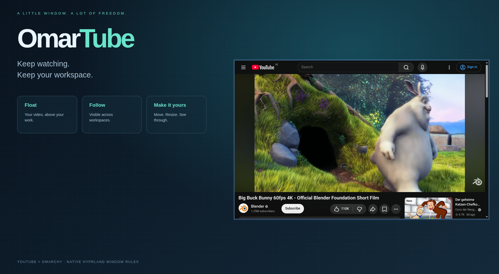
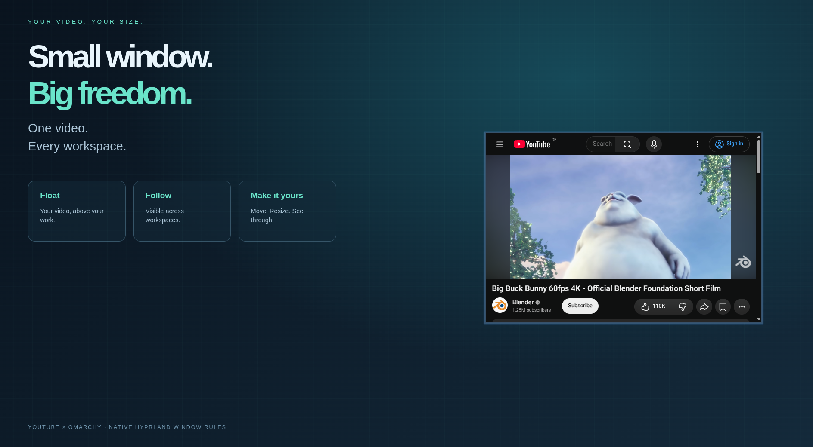

<div align="center">

# OmarTube

### Keep watching. Keep your workspace.

A floating, translucent YouTube window that follows you across Omarchy workspaces.

[](https://github.com/tcballard/omarchy-badges)

[](LICENSE)



</div>

Your tutorial, live stream, or background video deserves a little breathing room.
OmarTube turns Omarchy's existing YouTube web app into a movable, resizable window
that stays visible when you switch workspaces. Subtle transparency lets your
desktop show through.

**One small Lua file. Your existing browser. No extra player or background service.**

## Made to stay out of your way

| Feature | Behavior |
| --- | --- |
| Floating | Opens at 960 × 600, near the bottom-right corner |
| Across workspaces | Pinned above tiled windows on its monitor |
| Translucent | 90% opacity when focused; 85% when unfocused |
| Resizable | Hold **Super** and drag with the **right mouse button** |
| Movable | Hold **Super** and drag with the **left mouse button** |
| Familiar | YouTube search, playback, and sign-in work in your browser |



## Install

Requires Omarchy with its Lua-based Hyprland configuration and a working
YouTube web-app launcher. Tested with **Hyprland 0.56.2**.

```sh
git clone https://github.com/goarstne/omartube.git
cd omartube
cp ~/.config/hypr/hyprland.lua ~/.config/hypr/hyprland.lua.bak.$(date +%s)
cp omartube.lua ~/.config/hypr/omartube.lua
grep -Fxq 'require("hypr.omartube")' ~/.config/hypr/hyprland.lua || \
  printf '\nrequire("hypr.omartube")\n' >> ~/.config/hypr/hyprland.lua
hyprctl reload
hyprctl configerrors
```

`configerrors` should print no errors. Close and reopen any existing YouTube
app window so its initial size and pinning rules take effect.

Open **YouTube** from the application launcher, press **Super + Shift + Y**,
or run:

```sh
omarchy launch webapp https://youtube.com/
```

## Tune the feel

Edit `~/.config/hypr/omartube.lua` to change `size`, `move`, or `opacity`.
Reload with `hyprctl reload` and check `hyprctl configerrors` afterward.
Size and position are starting values; you can freely resize and move the window.

The rule matches YouTube **app windows**, using Omarchy's existing class pattern.
Ordinary browser tabs retain their normal behavior. Whole-window transparency
also affects the video. Pinning keeps the window above tiled windows across
workspaces; another floating window can still overlap it.

OmarTube is a local Hyprland customization, not a Quickshell plugin. It uses
Omarchy's `o.window()` helper and the same floating/pinning approach as its
built-in picture-in-picture rules. No packaged Omarchy files are modified.

## Remove

Delete `require("hypr.omartube")` from `~/.config/hypr/hyprland.lua`, remove
`~/.config/hypr/omartube.lua`, and reload Hyprland. Reopen YouTube to return
to Omarchy's default window behavior.

## Screenshots & credits

The screenshots are real Hyprland captures on a temporary virtual display,
with a designed demo backdrop and a separate, signed-out browser profile.
Desktop panels are cropped out. No personal accounts, messages, files,
browser history, or private desktop content are included.

Demo film: **Big Buck Bunny**, © Blender Foundation,
shown from [Blender's official YouTube upload](https://www.youtube.com/watch?v=aqz-KE-bpKQ).
Demo backdrop is presentation material, not an included desktop theme.
The “Built for Omarchy” badge is a community badge, not official certification.

[Hyprland window-rule documentation](https://wiki.hypr.land/Configuring/Basics/Window-Rules/)
· [MIT license](LICENSE)
