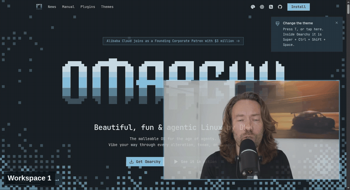

<div align="center">

# OmarTube

### Keep watching. Keep your workspace.

A floating, translucent YouTube window that follows you across Omarchy workspaces.

[](https://github.com/tcballard/omarchy-badges)

[](LICENSE)



</div>

Your tutorial, live stream, or background video deserves a little breathing room.
OmarTube turns Omarchy's existing YouTube web app into a movable, resizable window
that stays visible when you switch workspaces. Subtle transparency lets your
desktop show through.

**Your existing browser. Native Hyprland rules. Controls inside the running Omarchy shell.**

## Made to stay out of your way

| Feature | Behavior |
| --- | --- |
| Floating | Opens at 960 × 600, near the bottom-right corner |
| Across workspaces | Pinned above tiled windows on its monitor |
| Borderless | No window border, so only the page or video is visible |
| Translucent | 90% opacity when focused; 85% when unfocused |
| Resizable | Hold **Super** and drag with the **right mouse button** |
| Movable | Hold **Super** and drag with the **left mouse button** |
| Player fullscreen | Press **F** in YouTube; the video fills the floating window and scales when resized |
| Bar controls | Click the YouTube icon to adjust focused and unfocused transparency live |
| Familiar | YouTube search, playback, and sign-in work in your browser |


## Install

Requires Omarchy with its Lua-based Hyprland configuration and a working
YouTube web-app launcher. Tested with **Hyprland 0.56.2**, **Quickshell 0.3.1**,
and Python 3. No additional Python packages are needed.

```sh
git clone https://github.com/goarstne/omartube.git
cd omartube
python3 install.py
```

The installer backs up changed configuration files, links the plugin and window
rules into your user configuration, adds the bar icon, and rescans plugins.
Keep the checkout in place: the installed files are symlinks. Re-running the
installer preserves your settings and does not duplicate entries.

`configerrors` should print no errors. Close and reopen any existing YouTube
app window so its initial size and pinning rules take effect.

Open **YouTube** from the application launcher, press **Super + Shift + Y**,
or run:

```sh
omarchy launch webapp https://youtube.com/
```

You can also use **Super + Space → Apps → OmarTube**, or search for
**OmarTube** directly in the Omarchy menu. **OmarTube Controls** opens the
transparency panel. Both app entries are installed and removed automatically.

## Tune the feel

Click the **YouTube icon in the bar** for separate focused and unfocused
transparency sliders. Changes apply live and are saved in the plugin's
`shell.json` entry. **0% is fully opaque**; the maximum is 90% transparency
so the window stays findable. Use the mouse wheel or **Left/Right** keys;
**Tab** moves between controls and **Esc** closes the panel. **Reset** restores
10% focused / 15% unfocused transparency.

The service stays enabled when the bar icon is removed, and reapplies saved
values after a Hyprland reload. To move the icon using Omarchy's native tools:

```sh
omarchy bar move goarstne.omartube --section right
```

Press **F** while watching a video to enter player fullscreen inside the floating
window. **Super + right-drag** then resizes both the window and video. Press
**F** again to return to the normal YouTube page.

Edit `~/.config/hypr/omartube.lua` to change starting `size` or `move`.
Reload with `hyprctl reload` and check `hyprctl configerrors` afterward.
Size and position are starting values; you can freely resize and move the window.

The rule matches YouTube **app windows**, using Omarchy's existing class pattern.
Ordinary browser tabs retain their normal behavior. Whole-window transparency
also affects the video. Pinning keeps the window above tiled windows across
workspaces; another floating window can still overlap it.

The `goarstne.omartube` shell plugin combines a bar widget, a shared service,
and an on-demand panel opened through shell IPC. It uses Omarchy's existing
UI components, theme palette, and configuration persistence. The window rules
use `o.window()` and the same floating/pinning approach as Omarchy's built-in
picture-in-picture rules. No packaged Omarchy files are modified.

## Remove

```sh
python3 install.py --uninstall
```

Removes OmarTube's config entries and its own symlinks while preserving other
plugins and rules. Reopen YouTube to return to Omarchy's default window behavior.

## Checks

```sh
omarchy plugin validate .
lua tests/rules.lua
python3 tests/install.py
```

`tests/fullscreen.mjs` exercises **F → resize twice → F** against a YouTube
video in an isolated Chromium profile with a debugging port. It requires
Node.js with built-in WebSocket support and an explicit test window address:

```sh
node tests/fullscreen.mjs 0xYOUR_TEST_WINDOW_ADDRESS 9238
```

## Screenshots & credits

The animation and screenshot are real Hyprland captures on a temporary virtual
display with a separate, signed-out browser profile. Desktop panels are
cropped out; the captions were added afterward. No personal accounts, messages, files,
browser history, or private desktop content are included.

Animation: **Omarchy Quattro** by David Heinemeier Hansson,
shown from [his YouTube upload](https://www.youtube.com/watch?v=F7fe9pa8OeE),
above pages of [omarchy.org](https://omarchy.org).
Screenshot: **Big Buck Bunny**, © Blender Foundation,
shown from [Blender's official YouTube upload](https://www.youtube.com/watch?v=aqz-KE-bpKQ).
The “Built for Omarchy” badge is a community badge, not official certification.

[Hyprland window-rule documentation](https://wiki.hypr.land/Configuring/Basics/Window-Rules/)
· [MIT license](LICENSE)
